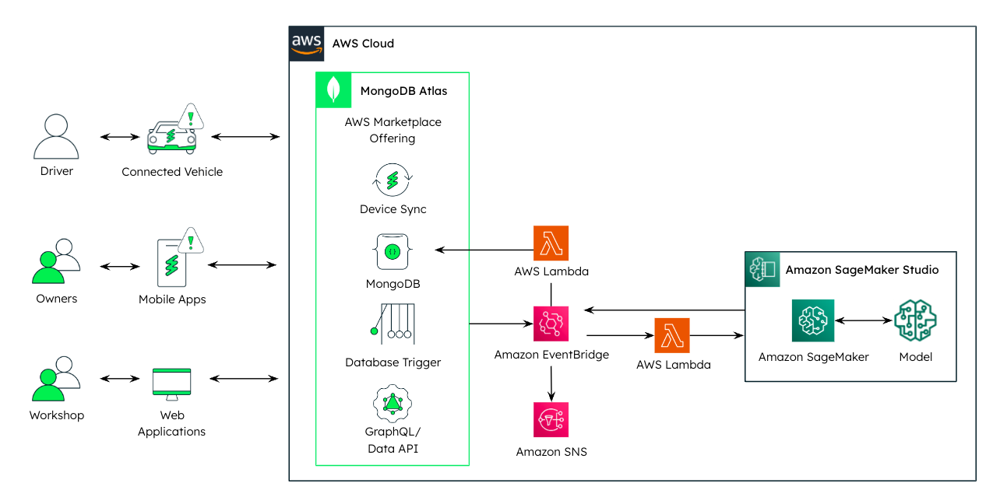

# Demo Environment Walk Through

Now that we’ve set up the MongoDB Atlas cloud backend, the Amazon Sagemaker Integration, connected the vehicle and the mobile app, let’s walk through the demo setup and architecture to bring it all together.

(If you're interested in watching the video format of this, feel free to click [Demo Video](https://youtu.be/8SztdPe6wJA).) 

 

*Quick Take* 

Looking at the architecture above, the demo setup includes a vehicle simulator built in TypeScript, which connects to a mobile device and a MongoDB Atlas backend using the Realm JavaScript SDK. The telemetry data collected from the vehicle is stored in MongoDB Atlas and sent to Amazon SageMaker for analysis through database triggers, and Event Bridge. The analyzed results are then returned to MongoDB and shared with all connected devices, including the mobile device, in near real-time.

# Let's get started!

## Navigate to your [MongoDB Atlas Account](https://account.mongodb.com/account/login) 

   * In the MongoDB Atlas Cloud dashboard we can see 3 collections: Vehicle information, Sensor, Components. (Collections might not be visible until you have started the vehicle simulator and submitted telemetry data).
    
     

## To start the vehicle

   Open the terminal window in the path: Digital-Twins-With-AWS/device-ts/. And then run the following command: 
      
      npm start

## Web UI and Mobile app
    
   1. Open the web console [http://localhost:3000]( http://localhost:3000). You should see the below WebUI of the connected vehicle:
   

   
   2. **Turning your engine on/off:** 
  To illustrate how fast data is synchronized between the vehicle model and the mobile app you can for example turn on the engine, by clicking on the       toggle button on your app and see how the engine gif starts moving indicating that the engine has been turned on. 
  
   3. **Adding components**:To further explain a little bit of the data modeling, we've also added a functionality to create related components. You can add a component by clicking "add component" in the web UI and you will see that information (that object),which is created for the spoiler, is immediately synchronized with the mobile device. 
    
   
   
   4. **Offline capablities**: You can also simulate what happens when the vehicle is not online. Since we are using a database inside the vehicle, all the   data changes are tracked and once you resume and click "sync", you will see that the status is immediately updated. Offline capabilities are intact! This is exciting, because you get actual live information and historical information about the vehicle.
   
   5. **Bucketing pattern in action**: Some sensors change way too frequently and synchronizing every single change to the backend would be inefficient. What we've implemented here with MongoDB Realm's offline capabilities is a bucketing pattern, where we cache 20 measurements and store them as an array in a single document. We have configured the bucket size to be 20 "Bucket: x number". Click the "Track Telemetry Button" until you've reached 20 items in the "Bucket". 

   6. **Sensor record**: Navigate back to your MongoDB Atlas account and into the Sensor collection. There you'll see under "measurements" 20 different objects representing: timestamp, voltage and current. 
   
 

## App Services Database Triggers and AWS Eventbridge 

1. Navigate to App Services. 
2. Navigate to Triggers under App Services. You'll see two triggers: 
    * analyze_battery_telemetry 
    * publish_battery_inference
3. Navigate into the analyze_battery_telemetry Trigger. This database trigger pushes the sensor record information to AWS Eventbridge. You'll notice the following: 
    * Cluster Name: Connected-Products 
    * Database Name: Integrations 
    * Collection Name: Sagemaker 
    * etc. 
  
 
 4. You'll see that the analyze_batter_telemetry function ran. If you want, you can navigate to the Functions tab in Atlas and you'll see that the publish_battery_inference JavaScrip function updates the vehicle model. You should see a red exclamation symbol on the WebUI as well as the mobile app. 
 

    
## How to clear status alerts 
1. Navigate back to the Vehicle Collection in MongoDB Atlas. In the battery status, you'll notice "NOK" which stands for "not ok." 
2. Navigate to your mobile app and click the "send command" button. This will reset your battery status within seconds. With MongoDB Atlas you can build a direct relationship between the commands related to a device, a vehicle, and the command object itself. It doesn't get easier than this! 

## GraphQL schema - avoiding the dreaded joins 
1. Navigate back to App Services into "Schema" 
2. Click on "Vehicle" schema. You will then see the JSON schema for the object. The object is automatically converted into classes for the different Realm SDKs. Below you'll see the relationship between the component and the vehicle: 

    
 3. This schema is automatically synchronized with the GraphQL schema. And if you navgigate into the GraphQL button, you'll see that you can directly query all of the relevant information across these different collections without doing any joins! 
  

    
# Congrats on completing the demo! 
You've ran through the demo and are now able to see how easily you can create a Digital Twin with MongoDB and AWS. Telemetry was just one use case, but consider how this can apply to improving customer experiences in: 
* Collecting and combining vehicle telemetry with weather data for automated route planning 
* Bidirectional communication between the driver and technical support for road assistance and remote problem solving 
* Driver profiling for reduced insurance fees
* and more! 

If you're interested to learn more about how you can use MongoDB to drive the next-generation of customer experiences and seamlessly solve Digital Twin Challenges, feel free to connect with: [industry.solutions@mongodb.com](industry.solutions@mongodb.com)

