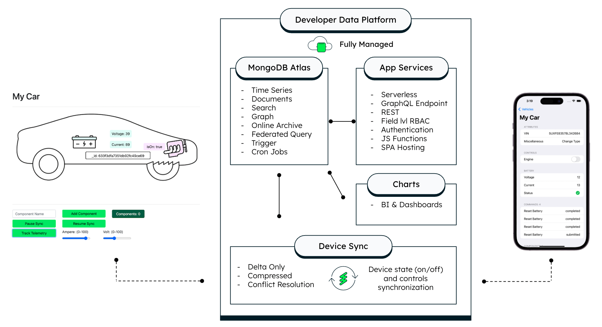

# MongoDB & AWS Connected Vehicle End to End Demo Repository
Code samples and demos around using the Realm database in combination with MongoDB Atlas, Device Sync and AWS Sagemaker.

[Demo Video](https://youtu.be/8SztdPe6wJA)

## MongoDB Atlas Backend Setup

[Setup MongoDB Atlas Backend](https://github.com/mongodb-industry-solutions/Digital-Twin-AWS-Blog/tree/main/atlas-backend)

## Typescript Vehicle Simulator

[Setup Device Simulator](https://github.com/mongodb-industry-solutions/Digital-Twin-AWS-Blog/tree/main/device-ts)

## iOS Swift Vehicle Controller Mobile App

[Setup iOS Mobile Application](https://github.com/mongodb-industry-solutions/Digital-Twin-AWS-Blog/tree/main/device-ts)

## AWS Sagemaker Integration (WIP)

[Setup AWS Sagemaker Integration](https://github.com/mongodb-industry-solutions/Digital-Twin-AWS-Blog/tree/main/aws-sagemaker)
