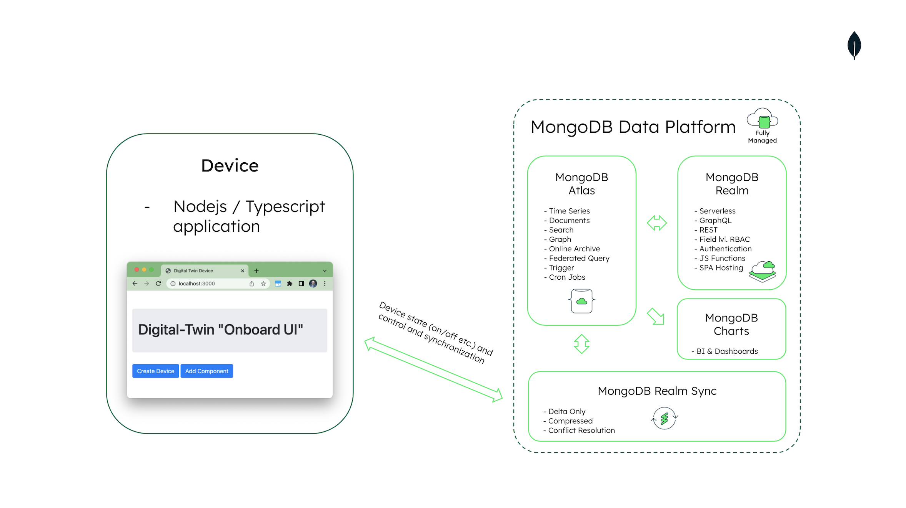

# MongoDB & Realm Connected-Devices Repository
Code samples and demos around using the Realm database in combination with MongoDB Atlas and device sync.

For the latest ( work in progress though ) demo including pretty visuals choose the "aws-connected-vehicle" branch!

## MongoDB Atlas Backend Setup

[Setup MongoDB Atlas Backend](https://github.com/mongodb-industry-solutions/connected-devices/tree/main/atlas-backend)

## Device Simulator Application

[Setup Device Simulator](https://github.com/mongodb-industry-solutions/connected-devices/tree/main/device-ts)

## iOS Mobile Application

[Setup iOS Mobile Application](https://github.com/mongodb-industry-solutions/connected-devices/tree/main/device-ts)

## PDF Setup Guide and First Use Guidance

[PDF Setup Guide](https://github.com/mongodb-industry-solutions/Connected-Devices/blob/main/Guide%20-%20Digital%20Twin%20Sanbox%20Environment.pdf)

