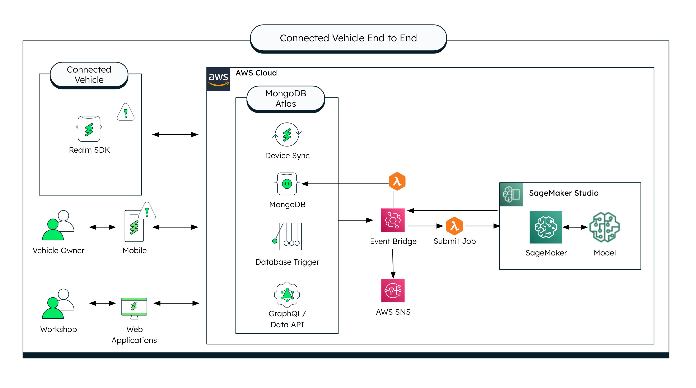

# Setup Instructions for AWS Sagemaker Integration

Now that you've finished the first three parts, you can start setting up your AWS Sagemaker integration. 

## Setup the AWS Backend
1. Create an [AWS Account](https://portal.aws.amazon.com/billing/signup#/start/email).
2. Take note of your AWS Account ID as you'll need it to set up your Digital Twin Application.

To be integrated: https://github.com/mongodb-partners/Vehicle-Digital-Twin-Solution

