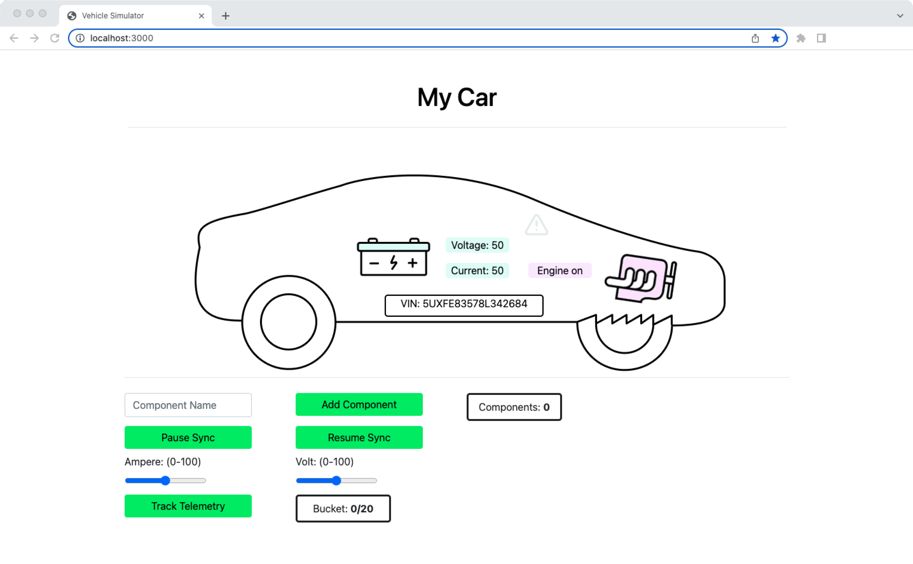

# Vehicle Simulator (TypeScript)

Here you will set up your vehicle simulator. We've provided three options for you to do so: 

* Locally
* Locally in a container
* On AWS VM. 

The most straightforward way is to run it locally, but you are free to choose the option best fit for you! 

After you've completed one of the options, you should see the following: 


## Prerequisites

* Installation of [Node.js](https://nodejs.org/) (Tested with Node.js v19.6.0)

* MongoDB Shell ([mongosh](https://www.mongodb.com/docs/mongodb-shell/#mongodb-binary-bin.mongosh)) installed (at least version 2.0)

* [Atlas Stream Processing](https://www.mongodb.com/docs/atlas/atlas-stream-processing/tutorial/) set up, in the detailed step by step that will require you to have prior:
* Have your Atlas account & project, previosuly created in [Part 1](../atlas-backend) with either a `Project Owner`or `Project Stream Processing Owner` role for a proper execution.

* A Database user with `atlasAdmin` role.

* An Atlas cluster.


## Option 1: Prepare and run "Vehicle Simulator" locally

1. Navigate into the vehicle-ts folder 
2. Update your App ID and the Atlas password if you have changed it while creating the atlas-backend (from [Part 1](../atlas-backend)) in `./src/ditto/DittoApp.ts`

3. Run the following command: 
      ```
      npm start
      ```
4. Open the web console http://localhost:3000. 

## Intermediary Step:
For demonstration purposes, we've set up a quick intermediary step so that you do not have to create an AWS account and can quickly see the demo come into action! This means you can already test the demonstration as we have bridged the Amazon SageMaker loop with MongoDB to have the first feeling of success!  

However, if you are interested in running the demo with AWS integration, please refer to our Partner repository: [Setup Instructions for MongoDB and Amazon SageMaker Integration](https://github.com/mongodb-partners/Vehicle-Digital-Twin-Solution). There we'll instruct you how to connect the whole feedback loop. 

## Option 2: Build and run "Vehicle Simulator" locally in a container

Prerequisites:
- [Docker Desktop](https://www.docker.com/) (may require license!) or alternatively [Colima](https://github.com/abiosoft/colima)

1. Run the following commands: 
    
    ```
    docker build . -t vehicle-ts 

    docker run -p 3000:3000 vehicle-ts
    ```

## Option 3: Build and run "Vehicle Simulator" on AWS VM

1. Run the following commands: 

      ```
      Sudo yum update
      
      Sudo yum install docker
      
      sudo systemctl enable docker.service

      sudo systemctl start docker.service

      git clone https://github.com/mongodb-industry-solutions/Vehicle-Digital-Twin-Feedback-Loop.git
      ```

2. Update your App ID (from [Part 1](../atlas-backend)) in `./src/ditto/DittoApp.ts`

3. Run the following commands:

      ```
      sudo docker build . -t vehicle-ts

      sudo docker run -p 3000:3000 vehicle-ts
      ```

4. Access simulator UI via `http:// PUBLIC IP ADDRESS:3000`

Congrats! The second part is completed. Now you'll continue setting up the iOS Swift Vehicle Controller Mobile Application in [Part 3](../mobile-swift).
